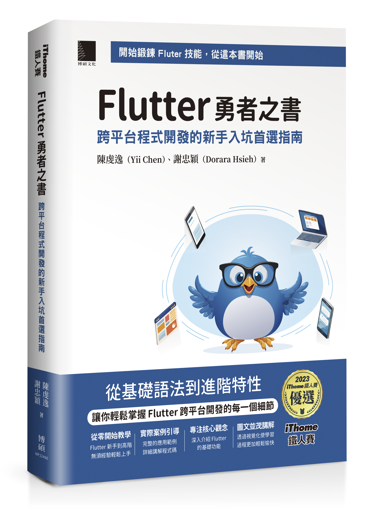
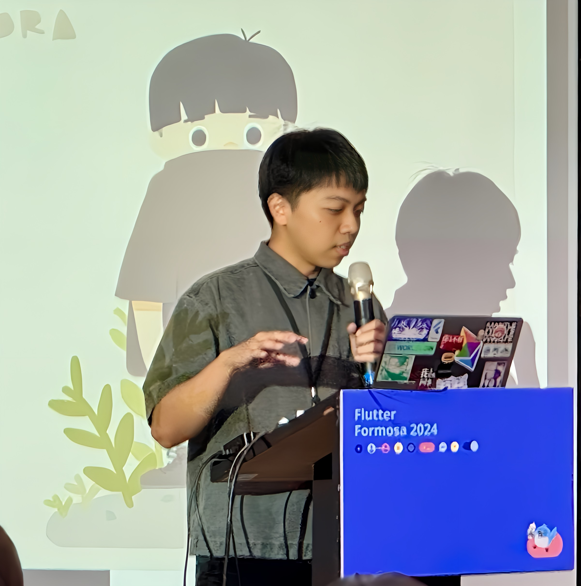

# Flutter 勇者之書: 跨平台程式開發的新手入坑首選指南

## 作者

[Yii Chen](https://github.com/chyiiiiiiiiiiii)           | [Dorara]()
:-------------------------:|:-------------------------:|
  |  

## 目錄

### CHAPTER.01 - 開發之旅的起點：Dart 和基礎功夫

- 1.1 Dart 內建類型
- 1.2 變數與類型
- 1.3 函式（Function）
- 1.4 泛型（Generics）
- 1.5 紀錄（Records）
- 1.6 模式（Patterns）
- 1.7 枚舉（Enum）
- 1.8 混入（Mixins）
- 1.9 擴充方法（Extension Methods）

### CHAPTER.02 - 搭建成功的開端：設置你的 Flutter 開發環境

- 2.1 安裝Flutter SDK
- 2.2 設置開發環境
- 2.3 FVM 管理開發平台

### CHAPTER.03 - 應用架構設計：建構你的開發藍圖

- 3.1 專案結構
- 3.2 模組化與重用

### CHAPTER.04 - 元件與佈局設計：為你的畫面注入靈魂

- 4.1 必須熟悉的UI 元件
- 4.2 Flutter 的佈局設計
- 4.3 Flutter 佈局核心概念
- 4.4 常見的佈局設計與實踐
- 4.5 訊息與視窗

### CHAPTER.05 - 動畫魔法：Flutter 應用中的視覺藝術

- 5.1 動畫分類
- 5.2 動畫主要元素
- 5.3 動畫選擇
- 5.4 動畫補充

範例程式碼與相關資源：
- https://github.com/chyiiiiiiiiiiii/flutter_animation_example

### CHAPTER.06 - 讓 App 有記憶：本地資料存取全解析

- 6.1 資料存取概述
- 6.2 SharedPreferences 的使用
- 6.3 SQLite 的使用
- 6.4 Flutter SecureStorage 的使用

### CHAPTER.07 - 穿越應用的秘密通道：路由導航全揭密
- 7.1 Navigator
- 7.2 Navigator 2.0

範例程式碼與相關資源：
- https://github.com/chyiiiiiiiiiiii/router_and_navigator_example

### CHAPTER.08 - 分身術：非同步與並行處理的秘技
- 8.1 Dart 和Flutter 運作原理
- 8.2 非同步基礎觀念
- 8.3 進階並行操作

範例程式碼與相關資源：
- https://github.com/chyiiiiiiiiiiii/dart_isolate

### CHAPTER.09 - 掌握數據之道：後端通訊與數據解析

- 9.1 RESTful API 介紹
- 9.2 HTTP 網路請求
- 9.3 序列化與反序列化
- 9.4 dio 網路請求套件

### CHAPTER.10 - UI 與數據的分工合作：揭開狀態管理的秘密

- 10.1 狀態管理基礎
- 10.2 基本狀態管理工具
- 10.3 Bloc 狀態管理套件
- 10.4 Riverpod 狀態管理套件

### CHAPTER.11 - 掌控應用脈動：解剖 Flutter 的生命週期

- 11.1 AppLifecycleListener
- 11.2 StatefulWidget 和 State 的生命週期

### CHAPTER.12 - Flutter 三巨頭：Widget Tree、Element Tree、RenderObject Tree

- 12.1 什麼是樹？
- 12.2 三棵樹
- 12.3 Flutter 高效運行的原因

### CHAPTER.13 - DevTools 深度探險：Flutter 應用性能的優化指南

- 13.1 何謂APP 的順暢表現？
- 13.2 專案的運行模式
- 13.3 DevTools 開發工具
- 13.4 Performance

### CHAPTER.14 - 從單元測試到整合測試：提升專案品質的最佳實踐

- 14.1 測試是什麼？
- 14.2 測試的差異與權衡
- 14.3 Unit Test（單元測試）
- 14.4 Widget Test (元件測試)
- 14.5 Integration Test (整合測試)
- 14.6 測試技巧
- 14.7 測試注意與建議
- 14.8 複習測試觀念

範例程式碼與相關資源：
- https://github.com/chyiiiiiiiiiiii/dart_flutter_testing_example

### CHAPTER.15 - AI 時代來臨：讓生成工具成為你的競爭優勢

- 15.1 生成式AI 的基礎知識
- 15.2 在Flutter 整合生成式AI

範例程式碼與相關資源：
- https://github.com/chyiiiiiiiiiiii/generative_ai_example
- https://github.com/chyiiiiiiiiiiii/flutter_vertex_ai_chat_example

### CHAPTER.16 - 學習無止境：開發者不可錯過的優質教材

- 16.1 推薦閱讀
- 16.2 延伸閱讀
- 16.3 開發利器
