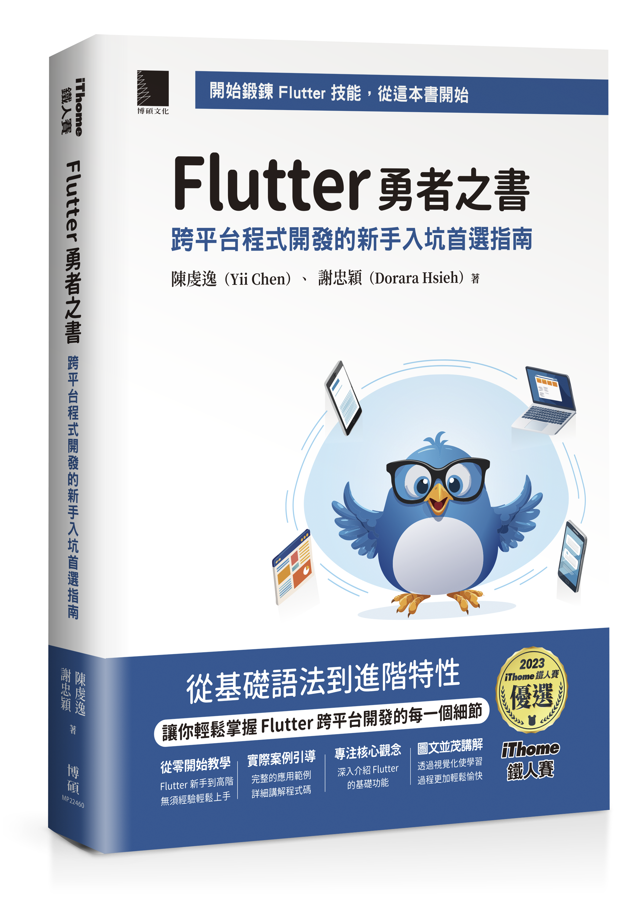
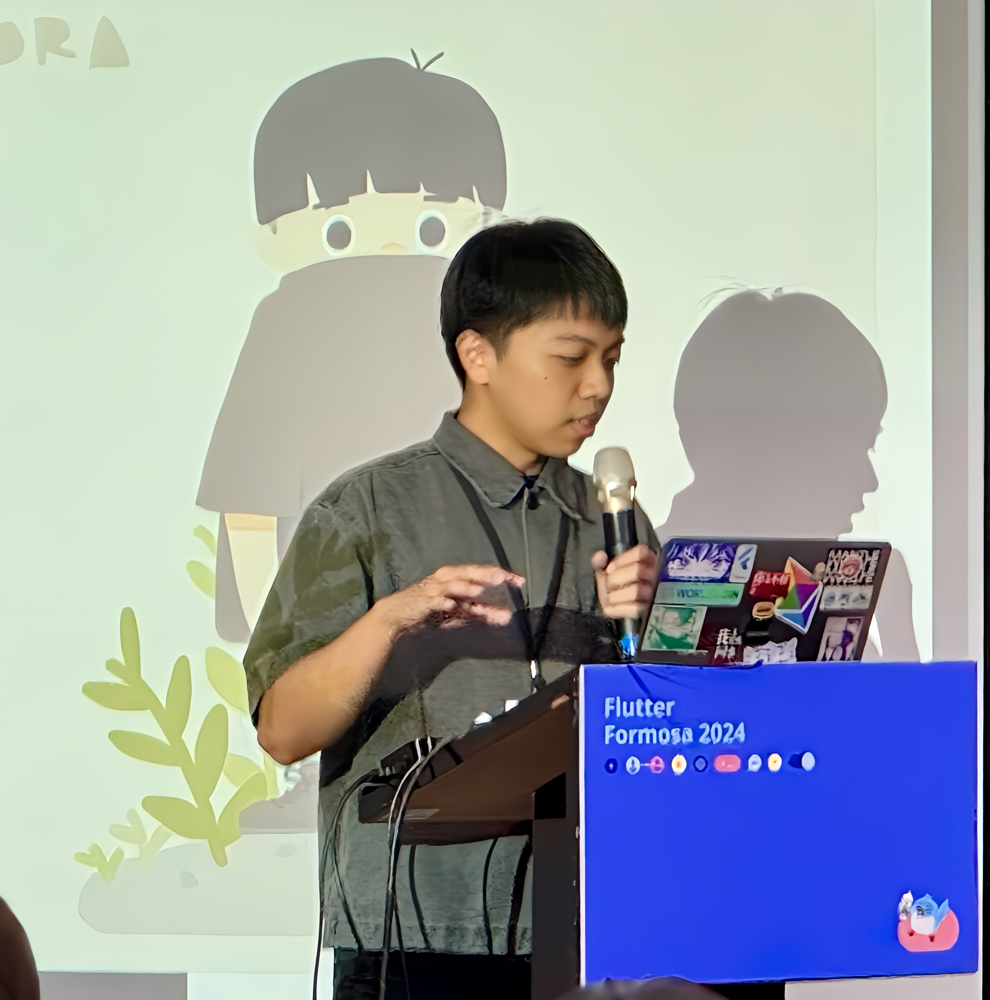

# Flutter Brave: The Ultimate Guide to Cross-Platform Development for Beginners

## Authors

[Yii Chen](https://github.com/chyiiiiiiiiiiii)           | [Dorara]()
:-------------------------:|:-------------------------:|
  |  

### CHAPTER 01 - The Beginning of Your Development Journey: Dart and Fundamentals

- 1.1 Built-in Types in Dart
- 1.2 Variables and Types
- 1.3 Functions
- 1.4 Generics
- 1.5 Records
- 1.6 Patterns
- 1.7 Enums
- 1.8 Mixins
- 1.9 Extension Methods

### CHAPTER 02 - Setting Up for Success: Configuring Your Flutter Development Environment

- 2.1 Installing Flutter SDK
- 2.2 Setting Up the Development Environment
- 2.3 Managing Development Platforms with FVM

### CHAPTER 03 - Application Architecture Design: Building Your Development Blueprint

- 3.1 Project Structure
- 3.2 Modularization and Reusability

### CHAPTER 04 - Component and Layout Design: Infusing Soul into Your Screens

- 4.1 Essential UI Components
- 4.2 Flutter Layout Design
- 4.3 Core Concepts of Flutter Layout
- 4.4 Common Layout Designs and Practices
- 4.5 Messages and Dialogs

### CHAPTER 05 - The Magic of Animation: Visual Arts in Flutter Applications

- 5.1 Categories of Animation
- 5.2 Key Elements of Animation
- 5.3 Choosing Animations
- 5.4 Additional Animation Resources

Sample Code and Related Resources:
- https://github.com/chyiiiiiiiiiiii/flutter_animation_example

### CHAPTER 06 - Making Your App Remember: A Comprehensive Guide to Local Data Access

- 6.1 Overview of Data Access
- 6.2 Using SharedPreferences
- 6.3 Using SQLite
- 6.4 Using Flutter SecureStorage

### CHAPTER 07 - Navigating the Secret Passages of Applications: A Complete Guide to Routing and Navigation
- 7.1 Navigator
- 7.2 Navigator 2.0

Sample Code and Related Resources:
- https://github.com/chyiiiiiiiiiiii/router_and_navigator_example

### CHAPTER 08 - The Art of Duplication: Secrets of Asynchronous and Concurrent Processing
- 8.1 How Dart and Flutter Work
- 8.2 Basics of Asynchrony
- 8.3 Advanced Concurrent Operations

Sample Code and Related Resources:
- https://github.com/chyiiiiiiiiiiii/dart_isolate

### CHAPTER 09 - Mastering the Path of Data: Backend Communication and Data Parsing

- 9.1 Introduction to RESTful APIs
- 9.2 HTTP Network Requests
- 9.3 Serialization and Deserialization
- 9.4 Using the Dio Networking Package

### CHAPTER 10 - The Collaboration of UI and Data: Unveiling the Secrets of State Management

- 10.1 Basics of State Management
- 10.2 Basic State Management Tools
- 10.3 Bloc State Management Package
- 10.4 Riverpod State Management Package

### CHAPTER 11 - Controlling the Pulse of Your Application: Dissecting the Flutter Lifecycle

- 11.1 AppLifecycleListener
- 11.2 Lifecycle of StatefulWidget and State

### CHAPTER 12 - The Three Giants of Flutter: Widget Tree, Element Tree, RenderObject Tree

- 12.1 What is a Tree?
- 12.2 The Three Trees
- 12.3 Why Flutter Runs Efficiently

### CHAPTER 13 - Deep Exploration of DevTools: A Guide to Optimizing Flutter Application Performance

- 13.1 What Constitutes Smooth App Performance?
- 13.2 Project Running Modes
- 13.3 DevTools Development Tools
- 13.4 Performance

### CHAPTER 14 - From Unit Testing to Integration Testing: Best Practices for Enhancing Project Quality

- 14.1 What is Testing?
- 14.2 Differences and Trade-offs in Testing
- 14.3 Unit Testing
- 14.4 Widget Testing
- 14.5 Integration Testing
- 14.6 Testing Techniques
- 14.7 Testing Considerations and Recommendations
- 14.8 Review of Testing Concepts

Sample Code and Related Resources:
- https://github.com/chyiiiiiiiiiiii/dart_flutter_testing_example

### CHAPTER 15 - The Arrival of the AI Era: Making Generative Tools Your Competitive Advantage

- 15.1 Basics of Generative AI
- 15.2 Integrating Generative AI in Flutter

Sample Code and Related Resources:
- https://github.com/chyiiiiiiiiiiii/generative_ai_example
- https://github.com/chyiiiiiiiiiiii/flutter_vertex_ai_chat_example

### CHAPTER 16 - Endless Learning: Essential Resources for Developers

- 16.1 Recommended Readings
- 16.2 Further Readings
- 16.3 Development Tools
